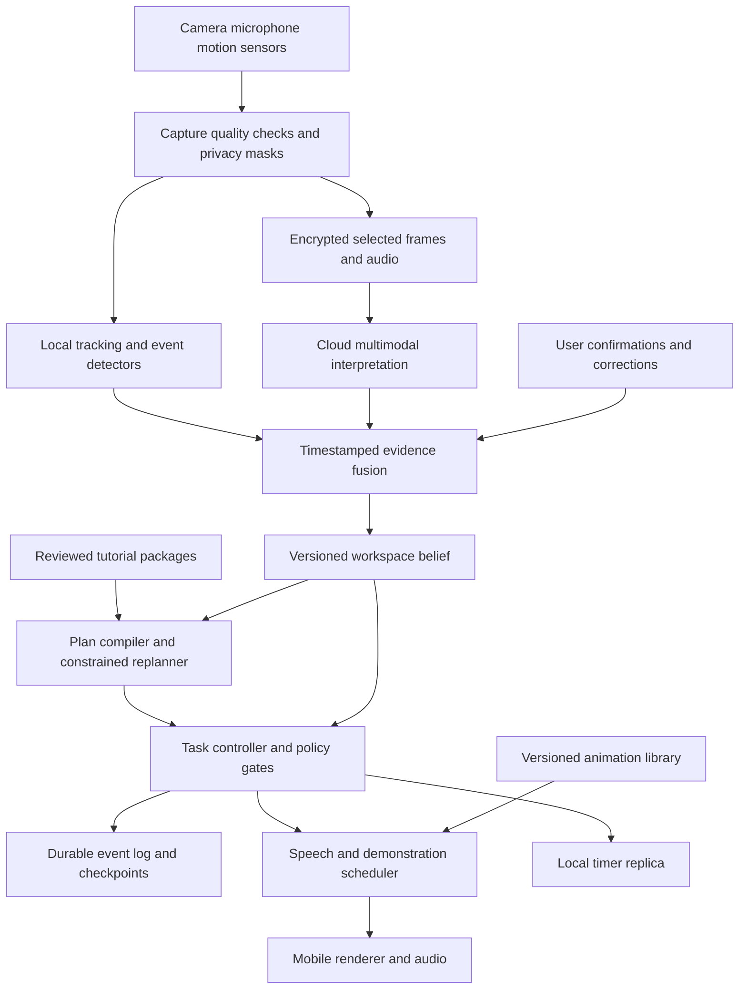
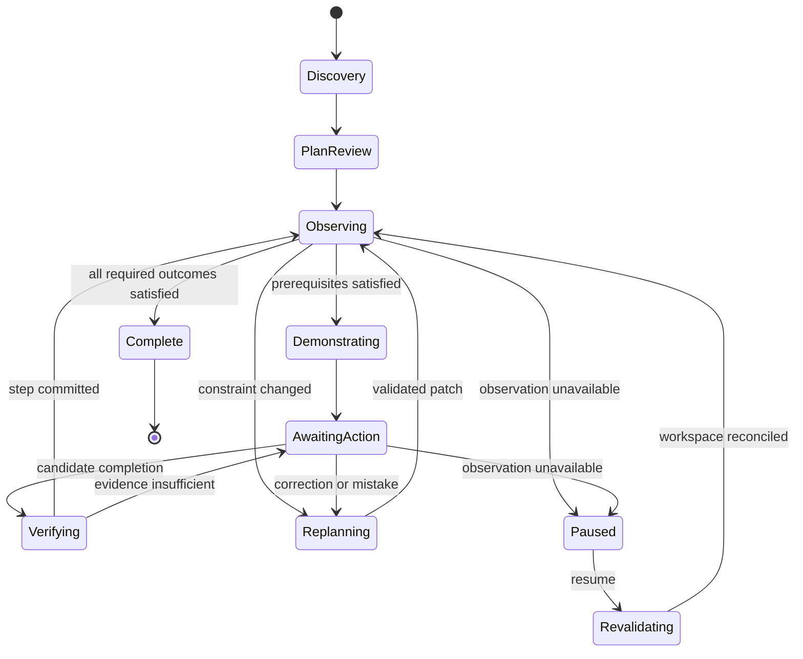
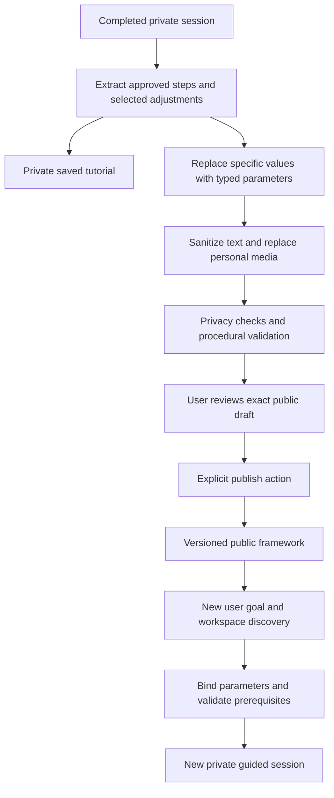

# Astra Real World Tutor Technical Design

Version 0.1 • September 10, 2026 • Proposed architecture

Astra is a camera-aware tutor that helps a person complete a physical task through conversation, live observation, and short animated demonstrations. A user says, “Help me fix this sink.” Astra establishes the available equipment, builds an executable plan, watches for relevant changes, demonstrates the next action, and verifies progress until the agreed outcome is achieved.

The central design decision is to run instruction through an evidence-backed task controller. A multimodal model proposes interpretations and adaptations; a typed runtime decides whether the evidence and prerequisites permit an instruction. This supports useful autonomy without treating a plausible description of a camera frame as proof that an action occurred.

This specification covers the user experience, perception, planning, animation, infrastructure, privacy, evaluation, and delivery sequence. It assumes an initial consumer mobile application for adults, beginning with a curated set of cooking tutorials and expanding to crafts, plant care, and simple assembly. Astra is the product’s tutor identity; the architecture does not depend on a particular model named Astra. All performance budgets and launch thresholds below are proposed engineering targets, not measured results.

## 1 Product goals and boundaries

The product should reduce the gap between understanding an instruction and performing it correctly. It must adapt to the user’s materials, pace, mistakes, and interruptions. Success means completing the user’s stated task while helping them understand the important decisions.

Continuous camera access means capture during an explicitly started tutorial session, subject to device permissions and platform lifecycle restrictions. It does not mean recording outside that session. Capture, cloud processing, and saved recordings are separate controls. Pausing observation stops capture and upload, while previously started timers continue and remain visible.

The initial release supports one primary user, one active workspace camera, one task with several concurrent steps, voice interaction, and reviewed tutorial packages. It does not promise general-purpose hazard detection, invisible measurements, exact physical simulation, or autonomous control of appliances. Unreviewed instructions involving electrical mains, gas repairs, medical procedures, or other high-consequence domains are outside the initial catalog.

| Requirement | Expected behavior | Acceptance evidence |
|---|---|---|
| Discover the workspace | Ask about missing ingredients, tools, preferences, and relevant constraints | No execution plan activates with unresolved required inputs |
| Observe continuously | Track relevant objects and state changes during an active session | Perception remains active through the defined device endurance test |
| Demonstrate actions | Play a short human or hand animation appropriate to the actual step | Every launch step requiring a motion demonstration has a reviewed asset or approved fallback |
| Verify progress | Advance only when the step’s evidence policy is satisfied | No unsupported transition in the release blocker regression suite |
| Recover | Replan after substitutions, mistakes, or interruptions | Recovery scenarios preserve completed work and active timers |
| Finish explicitly | Evaluate the original goal and report remaining cleanup | User receives a completion summary with unresolved items called out |
| Save and share | Offer a private saved tutorial or a sanitized public framework | Publication requires a preview and explicit publish action; new users receive a freshly validated plan |

## 2 The pasta experience

### 2.1 Establish the goal

**User:** “Help me make pasta.”

**Astra:** “How many people are you cooking for, and are you using dried pasta or making the dough?”

Once the user chooses dried pasta, Astra asks about dietary restrictions and invites a brief workspace scan: “Show me the pasta, sauce ingredients, and the pot you want to use.” It identifies candidates, highlights them on the preview, and confirms consequential ambiguities. It can read package text, but asks for a clearer view if instructions are obscured. It asks whether a strainer is available and adapts the draining method only through an approved tutorial branch.

Discovery is progressive. Astra does not read out a long questionnaire when two observations can answer most of it. A compact inventory distinguishes “seen,” “you told me,” and “still needed.” Estimated quantities remain estimates until confirmed or measured.

### 2.2 Prepare the workspace

Astra asks the user to place the phone securely with a view of the pot and preparation surface. A framing guide reports “pot visible” and “preparation area outside view.” It does not ask the user to hold a phone over boiling water to improve detection.

The app presents a short plan: prepare the water, heat it, prepare the sauce during the wait, add pasta, check texture, combine, and finish. Exact cooking instructions come from the selected reviewed recipe and package directions. The user can change servings or simplify the recipe before starting.

### 2.3 Observe and demonstrate

While water heats, Astra tracks the selected pot and periodically evaluates a boiling hypothesis. Steam alone is insufficient: the detector considers visible surface motion, persistent bubbling, image quality, and whether the scene is actually the selected pot. Audio can support the hypothesis but does not independently prove boiling.

When the configured evidence gate passes, Astra says, “The water appears to be boiling. Here’s the next step.” A three-second inset animation shows a person adding pasta into a pot using the reviewed motion. The real camera preview remains visible. If the view is inconclusive, Astra asks, “Are you seeing steady bubbles across the surface?” The runtime records the resulting state as user-confirmed rather than camera-verified.

The animation demonstrates an action; it does not complete it. Astra waits for evidence that pasta entered the pot or a direct confirmation. Only then does it start the cooking timer. A boiling event alone cannot start that timer.

### 2.4 Manage the rest of the task

If sauce preparation overlaps with boiling, Astra schedules both branches and interrupts at useful moments. It avoids speaking while the user is carrying a hot pot unless a time-sensitive cue is necessary. If pasta was added off camera, it asks whether that happened and approximately when, then records uncertainty in the timer start.

Astra cannot see texture or taste reliably. It prompts the user to perform the recipe’s doneness check and describe the result. “Still firm” extends the relevant branch without restarting the whole tutorial. Once the dish meets the user’s goal, Astra confirms completion, asks about unresolved heat sources, and offers a brief account of what the user learned. Visual absence of a flame is not proof that every appliance is off.

### 2.5 Save or share the tutorial

The completion screen offers **Save to my account**, **Share publicly**, and **Done**. Saving creates a reusable private tutorial with the user’s chosen adjustments. Sharing prepares a separate public framework: Astra removes personal details, replaces session-specific objects with requirements, and shows exactly what will be published. The user can do both. Neither choice requires saving the camera recording. A new user opening the public tutorial selects **Adapt to my situation**, answers only the necessary questions, and receives a fresh plan for their own workspace.

## 3 Interaction model

The main screen contains a camera preview, one current instruction, a replayable demonstration, timers, and a small progress indicator. Secondary details open on request. Voice commands include “repeat,” “slower,” “why,” “I already did that,” “I don’t have it,” “pause camera,” “undo that confirmation,” and “stop the tutorial.”

“Undo” corrects the task record; it never implies reversing an irreversible physical action. If the user says they added too much of an ingredient, Astra enters a recovery branch instead of decrementing inventory as if the material could be removed.

The tutor uses four distinct speech purposes: instruction, explanation, clarification, and urgent interruption. Their priority is urgent interruption, user response, time-sensitive task cue, then optional explanation. The speech scheduler cancels stale queued messages when the plan changes. Barge-in stops speech and animation immediately without silently changing the task state.

Accessibility options include captions, large controls, slower animations, left-handed demonstrations, adjustable verbosity, high-contrast overlays, and audio descriptions. Instructions never depend only on color. Gesture commands are limited to low-consequence controls such as replay; hand motion cannot confirm a consequential action by itself. A user can complete supported tutorials through explicit confirmations when vision is unavailable.

### Additional features

| Feature | User benefit | Technical requirement | Delivery stage |
|---|---|---|---|
| Adaptive discovery | Fewer unnecessary questions | Missing-input analysis and question selection | Initial release |
| Parallel task conductor | Handles sauce, water, and timers together | Resource-constrained task graph and interruption policy | Initial release |
| Recovery coach | Adapts after mistakes | Reviewed recovery branches and dependency invalidation | Initial release |
| Explain before acting | Shows why a step matters | Explanations linked to approved step semantics | Initial release |
| Personal skill memory | Reduces repetition as ability improves | Opt-in history with user-editable skill estimates | Next release |
| Workspace memory | Remembers preferred tools | Object aliases and revalidation at session start | Next release |
| Outcome preview | Shows the intended intermediate state | Reviewed reference images and known limitations | Next release |
| Spatial ghost hands | Demonstrates motion near the real object | Reliable anchors, scale, occlusion, and action retargeting | Research track |
| Second camera | Improves coverage without moving the phone | Secure pairing, clock alignment, identity reconciliation | Next release |
| Teach-back mode | Builds independent skill | Scored user explanations and optional reduced prompting | Next release |
| Expert escalation | Helps resolve unsupported situations | Explicit invitation, live handoff, consented context sharing | Later release |
| Tutorial studio | Expands the catalog systematically | Authoring, validators, review workflow, signed packages | Internal tool first |
| Personal tutorial library | Repeats successful tasks with preferred adjustments | Durable private frameworks separate from session history | Initial release |
| Public adaptive tutorials | Lets others reuse a successful approach | Sanitization, parameter extraction, publication review, fresh plan compilation | Next release |

Personalization changes pacing and explanations, not mandatory prerequisites or evidence gates. Accessibility preferences are explicitly selected; the app should not infer disability, identity, or sensitive traits from appearance.

## 4 System architecture



The **device** owns capture, local quality checks, lightweight tracking, privacy controls, presentation, and timers. The **session service** owns the authoritative online task revision and durable event history. The **model gateway** normalizes vendor-specific multimodal interfaces into typed evidence proposals and plan proposals. The **catalog service** distributes signed tutorials, policy versions, and assets.

Start with a modular backend application plus separate media and inference workers. Do not create a network service for every logical box. Extract services when scaling, isolation, or ownership requires it. Media workers scale with active streams, semantic inference with request volume, and durable storage with session events.

WebRTC is a candidate for interactive media transport, while reliable application events use a separate authenticated channel. Browser capture is permission-based; a browser prototype must handle capture lifecycle events instead of assuming indefinite camera availability. These are platform foundations, not guarantees of application latency. See the [W3C WebRTC specification](https://www.w3.org/TR/webrtc/) and [Media Capture and Streams specification](https://www.w3.org/TR/mediacapture-streams/).

## 5 Perception and the workspace model

### 5.1 Several rates of observation

Use a fast local loop for object tracking, frame quality, and selected movement cues. Use slower semantic analysis for interpreting the scene, reading labels, and resolving changes. Begin experiments with 15–30 fps preview, 5–15 fps lightweight tracking, 0.5–2 fps semantic sampling, and short higher-rate windows near expected transitions. These are tunable budgets, not a claim that all target phones can sustain them.

Hands, vessels, tools, ingredients, active surfaces, and regions of interest have persistent track IDs. A confidence score on an object label is separate from confidence about the object’s state. The tracker may know which pot it sees while remaining uncertain whether its contents are boiling.

Hand landmarks can help locate and follow hands in video, but do not establish whether a user performed an action correctly. MediaPipe provides an implementation candidate for this component; action verification still requires task-specific evidence and evaluation. See the [official Hand Landmarker guide](https://developers.google.com/edge/mediapipe/solutions/vision/hand_landmarker/android).

### 5.2 Structured belief

Represent the workspace as entities, relationships, state hypotheses, and observations:

```typescript
type EvidenceSource = 'vision' | 'audio' | 'user' | 'sensor';
type FactStatus = 'unknown' | 'supported' | 'contradicted' | 'stale';

interface Evidence {
  id: string;
  sessionId: string;
  entityId: string;
  predicate: string;
  value: unknown;
  source: EvidenceSource;
  capturedAtMs: number;
  receivedAtMs: number;
  confidence?: number;       // calibrated detector score, not model self-rating
  validForMs: number;
  correlationGroup: string;  // related frames are not independent votes
  observationEpoch: number; // changes after camera interruption or relocalization
  modelVersion?: string;
}

interface WorldFact {
  entityId: string;
  predicate: string;
  status: FactStatus;
  evidenceIds: string[];
  provenance: 'observed' | 'user_confirmed' | 'inferred';
  revision: number;
}
```

“Pot contains water” and “water is boiling” are different predicates with different expiration policies. Dynamic facts expire quickly when observation is lost. More persistent facts, such as a confirmed utensil type, can survive briefly but must be re-associated after substantial camera movement. A remembered pot is not automatically the same pot seen next session.

Perception never treats model-generated captions as commands. Text on a package, background screen, or tutorial import is untrusted task data. It cannot change system policy, invoke a tool, or grant permission.

### 5.3 Event verification

Each event detector has a policy defining prerequisites, minimum view quality, temporal persistence, alternative confirmation methods, and expiration. A boiling detector requires the selected vessel to be visible and a sustained pattern consistent with boiling. Repeated adjacent frames count as correlated evidence. Use hysteresis and a cooldown so transient bubbles do not alternate the interface between “boiling” and “not boiling.”

Scores must be calibrated on labeled data from held-out kitchens and devices. Do not choose a universal threshold such as 0.9 across all detectors. A low-consequence object highlight and a consequential step transition need different operating points. If no acceptable operating point exists, the product uses a confirmation-only gate for that event.

Unknown, false, and unseen are distinct states. “I cannot see the stove” cannot become “the stove is off.” Contradictory user and visual evidence triggers clarification when the contradiction affects the next action; it is not resolved by blindly trusting whichever arrived last.

## 6 Tutorial representation and planning

A tutorial is a versioned directed graph of steps, branches, resources, and outcome predicates. A recipe is one tutorial specialization. The planner compiles the user’s goal and available materials into this representation using reviewed catalog content.

Each step declares prerequisites, required objects, an instruction template, animation binding, start and completion evidence, duration bounds, interruptibility, risk class, and recovery branches. Resource claims include burner occupancy, shared tools, and the user’s attention. Passive waiting can overlap with preparation; two actions requiring both hands cannot be scheduled simultaneously for one user.

```yaml
id: add_dried_pasta
requires:
  - fact: selected_pot.contains_water
    status: supported
  - fact: selected_pot.water_boiling
    evidence_policy: boiling_v2
  - fact: pasta.portion_ready
    status: supported
instruction_template: add_pasta_v3
animation:
  asset: cooking.add_pasta.v4
  target: selected_pot
  default_mode: inset
resources:
  user_attention: exclusive
  selected_pot: exclusive
completion:
  policy: pasta_added_v2
  alternatives:
    - observed_transfer_to_selected_pot
    - explicit_user_confirmation
effects:
  - mark: selected_pot.contains_pasta
  - start_timer: pasta_cooking
recovery:
  uncertain_start_time: ask_elapsed_time
  incompatible_pot: pause_and_replan
```

The symbolic conditions in this example resolve through a registry of typed predicates and policies. Arbitrary strings do not become executable code. The compiler rejects missing policy references, invalid units, unresolved objects, unintended cycles, conflicting resource claims, and branches without reachable outcomes. Intentional loops, such as repeat a texture check, require exit conditions and bounded retry behavior.

### Choosing questions

Question selection balances expected uncertainty reduction, decision consequence, interruption cost, and user effort. Ask what materially changes the plan first: dried versus fresh pasta, available tools, servings, and stated dietary restrictions. Avoid asking users to measure details that will not change any branch. At a critical ambiguity, ask one concrete question instead of giving multiple speculative instructions.

### Replanning

The model proposes a patch to the remaining graph. A validator checks that the patch preserves completed irreversible actions, accounts for consumed materials, retains active timers, and does not weaken mandatory gates. The controller installs the patch atomically against an expected plan revision. If the user changes the goal, Astra summarizes the new outcome and any work that can be reused.

The model may explain and choose among supported substitutions. It cannot invent a safety-sensitive branch simply because the user lacks a tool. Unsupported changes move the session to clarification or a reviewed alternative task.

## 7 Task execution and consistency



The diagram shows the normal path. Stop, degraded operation, and risk interruption are global transitions available from every active state. Task state and observation state are separate dimensions: a paused camera does not freeze a pot, stop a running timer, or reverse progress.

**Execution invariants**

1. A demonstration is never evidence of user action.
2. No instruction activates with unresolved mandatory prerequisites.
3. Each step completion commits at most once for a given execution instance.
4. Stale observations cannot authorize a fresh consequential transition.
5. A correction invalidates dependent conclusions and triggers reconciliation.
6. Completion requires all required goal predicates, with provenance preserved.
7. Camera pause and session stop override every request to capture or upload.

The online session uses a single authoritative writer with optimistic revision checks. Evidence may arrive out of order; the controller considers capture time, observation epoch, and validity, not merely receipt order. A late “pot boiling” result from before a camera interruption is rejected for current authorization.

Reliable event delivery uses at-least-once transport with idempotency keys. Committing a completion and starting its timer occur in one durable transaction or transactional outbox operation. Retrying after a dropped acknowledgment cannot start a second timer or replay an obsolete instruction.

### Offline behavior

The initial release allows local timers, cached instructions, replay, and user-confirmed progression through explicitly marked offline-capable steps. It does not silently claim live semantic observation without a running detector. On disconnect, cloud execution freezes and the device enters a separate provisional epoch. The backend will not advance without current client acknowledgments. On reconnect, the client submits its ordered provisional events; the server reconciles them before issuing any new instruction. Conflicts require user clarification rather than speculative merging.

Timer duration uses a monotonic clock while the process is alive. Persist an approximate wall-clock deadline for process restart, detect clock discontinuities, and ask for confirmation when elapsed time is uncertain. Platform notification delivery is a fallback with its own permission and lifecycle limitations, not a precise execution guarantee.

## 8 Animation and spatial demonstrations

The first release uses a reviewed library of short 3D human or hand demonstrations rendered into an inset card. Parameterization supports viewpoint, playback speed, handedness, tool family, and a restricted range of object sizes. It provides the requested real-time action demonstration without waiting for a new video to be generated at the moment the action is needed.

Every asset has an action ID, compatible tools, prerequisites, semantic start and end states, handedness support, safe parameter bounds, review status, and fallback illustration. Prefetch likely next-step assets during waiting periods. A controller-issued animation command includes the step revision and expiration so a delayed animation cannot illustrate a superseded instruction.

Free-form generated video is an offline authoring aid. Human reviewers verify the motion before it joins the runtime library. Generating an apparently convincing but physically incorrect motion during a live task is an unacceptable dependency for the initial design.

### Spatial overlay research

Later versions may anchor translucent hands or a tool trajectory near a real object. The renderer needs camera calibration, estimated scale, target pose, tracking quality, occlusion handling, and motion constraints. A generic animation cannot simply be stretched to arbitrary equipment; permitted retargeting ranges must be authored and tested.

If tracking quality falls, hide the spatial overlay and return to the inset. Do not leave a drifting hand pointing toward the wrong object. Spatial demonstrations are illustrative unless the supported hardware and validation establish the required metric accuracy.

Apple’s spatial APIs provide anchor concepts, but support and semantics vary by platform; a visionOS world anchor does not establish object-relative accuracy on an iPhone. An engineering spike must select the correct device-specific tracking APIs and validate them independently. See [RealityKit anchors](https://developer.apple.com/documentation/realitykit/scene-content-anchors) and [ARKit WorldAnchor](https://developer.apple.com/documentation/arkit/worldanchor).

## 9 Interfaces and storage

| Interface | Purpose | Important fields |
|---|---|---|
| `POST /sessions` | Create scoped tutorial session | goal, capabilities, locale, consent choices |
| `POST /sessions/{id}/confirmations` | Submit user assertion or correction | step execution ID, expected revision, idempotency key |
| `POST /sessions/{id}/plan-patches` | Submit validated proposed change | base revision, patch, rationale, evidence references |
| `GET /sessions/{id}/events` | Resume reliable event stream | after sequence, session epoch |
| `POST /sessions/{id}/observation-state` | Pause or resume observation | capture state, epoch, reason |
| `POST /sessions/{id}/stop` | End capture and execution | idempotency key, final local sequence |
| `DELETE /sessions/{id}` | Request deletion | authorization, deletion request ID |

The device stops capture locally before waiting for a pause or stop acknowledgment. Session creation returns short-lived media credentials scoped to that session. Every endpoint checks account and session ownership. Service-to-service perception channels are not exposed as trusted user-facing mutation endpoints.

```json
{
  "event_id": "evt_1042",
  "session_id": "session_abc",
  "sequence": 42,
  "type": "step.committed",
  "plan_revision": 7,
  "step_execution_id": "add_pasta_attempt_1",
  "observation_epoch": 3,
  "evidence_ids": ["user_confirmation_17"],
  "provenance": "user_confirmed",
  "effects": [{"type": "timer.start", "timer_id": "pasta_cooking"}]
}
```

Use a relational database for sessions, tutorial metadata, consent records, and ordered task events. Store reviewed assets and explicitly opted-in recordings in object storage with separate access policies. Keep ephemeral media buffers out of the durable event log. Search over the tutorial catalog may use semantic retrieval, but the selected package must resolve to a reviewed version before execution.

Checkpoints include the plan version, world facts with provenance and expiration, completed steps, remaining quantities where known, timer state, and observation epoch. Pin model, policy, and tutorial versions for replay; policy revocation can still interrupt a session if a package is withdrawn for a serious defect.

## 10 Privacy and security design

Default processing keeps raw video ephemeral. The device uses a bounded memory buffer, proposed at ten seconds, for event-window analysis; selected crops or frames are sent to cloud interpretation when enabled. Cloud services process these without application-level archival. Production deployment must separately verify provider logging, retention, regional processing, and deletion terms before claiming equivalent behavior end to end.

Store structured task progress for thirty days by default, with immediate user deletion available. Optional skill memory uses a separate opt-in and can be inspected or cleared. Saved video and model-training consent are independent opt-ins, both off by default. Raw media, transcripts, and sensitive image crops are excluded from ordinary application logs and crash reports.

Explicitly saved private tutorials persist until the user deletes them, independently of the thirty-day session history. Public frameworks have a separate publication lifecycle and contain no public links to private session evidence. Sharing a framework does not grant permission to retain its source recording or use either artifact for model training. Section 16 specifies publication, deletion, and adaptation behavior.

Before starting, explain what the camera sees, what leaves the device, and what persists. Offer local-only supported tutorials and manual confirmation when cloud processing is declined. Display capture and upload state separately. Users can mask regions or choose a workspace crop. If that mask hides a required object, explain the observation limitation and use confirmation; do not remove the mask automatically.

Authenticate media workers, encrypt transport and stored data, use short-lived credentials, validate signed assets, and rate-limit sessions. Redact bystander regions locally when feasible, but do not present imperfect redaction as guaranteed anonymity. A household or shared device must not expose one account’s past sessions to another.

Deletion removes accessible session data, derived user memory linked to the session, and optional media, and tracks downstream deletion requests. Backups follow a documented bounded expiry and must not repopulate deleted records during restoration. Publish the actual implemented retention schedule after infrastructure selection.

Threat modeling includes malicious tutorial imports, prompt injection in visible text, replayed evidence, account crossover, forged completion events, and compromised animation assets. Imported tutorials enter an unpublished review state. Neither OCR nor model output may directly issue arbitrary tool calls or database commands.

## 11 Failure handling

| Failure | Detection | Runtime response |
|---|---|---|
| Steam or hand occludes the pot | Visibility and image-quality drop | Expire affected facts; ask for confirmation when needed |
| Camera moves to another room | Tracking loss or scene discontinuity | Begin new observation epoch and re-associate objects |
| False boiling candidate | Insufficient temporal evidence or contradiction | Hold the transition; ask a targeted question |
| Action occurs off camera | Expected effect without observed action | Ask what happened and label the answer as user evidence |
| Network loss | Transport health check | Enter declared offline mode; preserve timers |
| Thermal or battery pressure | Device health telemetry | Reduce analysis rate, disable costly overlays, offer manual mode |
| Model times out | Deadline exceeded | Use cached instruction or clarification; never invent completion |
| Asset unavailable | Cache or signature failure | Use approved illustration and spoken instruction |
| User changes tools mid-step | Inventory contradiction | Revalidate compatibility and remaining plan |
| Duplicate or delayed event | Sequence, epoch, and idempotency checks | Deduplicate or reject without repeating effects |
| App is backgrounded or terminated | Platform lifecycle and checkpoint recovery | Mark observation unavailable; restore and reconcile on return |
| Unsupported or uncertain risky condition | Policy gate or user report | Pause progression and provide the reviewed domain response |

Hazard cues are supplementary assistance. The application cannot guarantee that a room, appliance, or action is safe because a camera detector found no problem. For the initial catalog, domain reviewers define allowed instructions, escalation text, and conditions requiring direct user checks. This specification does not prescribe emergency procedures or replace appliance instructions.

## 12 Performance and operating cost

Measure latency against distinct events. A detector’s deliberate persistence window is part of detection delay; it must not be hidden from the user-facing time-to-cue metric.

| Metric | Proposed target | Measurement boundary |
|---|---|---|
| Voice barge-in response | p95 under 200 ms | Local speech onset detection to playback cancellation |
| Cached animation start | p95 under 250 ms | Accepted presentation command to first rendered frame |
| Local evidence to cue | p95 under 500 ms | Evidence gate acceptance to first visible or audible cue |
| Supported visual event to cue | p95 under 3 seconds | Ground-truth event onset to cue, including temporal verification |
| Simple voice response | p95 under 1.5 seconds | User utterance end to first meaningful audio |
| Complex replan | p95 under 5 seconds | Confirmed constraint change to validated plan availability |
| Session start availability | 99.5 percent pilot target | Successful eligible starts divided by attempts |

Benchmark on named supported devices under defined light, network, and session-duration conditions. If model or detector latency cannot meet the budget, reduce the supported autonomous transitions rather than quietly measuring only favorable cases.

For a 25-minute session, continuous semantic sampling at 1 fps produces 1,500 analyzed images. As an illustrative adaptive schedule, 20 minutes at 0.25 fps plus 5 minutes at 2 fps produces 900 images. At an assumed 100 KB per uploaded image, that is approximately 90 MB before audio, protocol overhead, or retries. Local continuous capture does not require continuous cloud frame upload.

Use an explicit cost model:

`session cost = analyzed images × effective image cost + input audio minutes × audio input rate + output audio minutes × audio output rate + text usage + media transport + backend compute + storage`

Track cost per completed task as well as cost per minute, because cheaper inference that causes repeated failures may cost more overall. No vendor prices are assumed here. Cache assets, batch nonurgent interpretation, reuse object tracks, crop task regions, and select models by measured task performance. Cost controls must not silently reduce a required evidence policy; they can switch to an explicit confirmation path.

## 13 Evaluation and release gates

Build a consented test corpus with time-aligned ground truth for object identity, relevant states, action onset and completion, occlusion, user confirmations, and goal outcomes. Split by household, actor, and recording session to avoid near-duplicate leakage. Include different devices, lighting, cookware, accents, hand appearances, left-handed actions, limited camera views, and deliberate interruptions.

The core model metric is **unsupported autonomous advancement**: the runtime advanced from visual or sensor evidence even though the required condition was not actually satisfied. Report it by event class and consequence, alongside missed detections, detection delay, correction rate, and coverage. A system that asks for confirmation on every step may have few false transitions but poor autonomous coverage; report both.

Initial pilot gates:

- Zero invariant violations across deterministic controller, duplicate-event, stale-frame, camera-pause, and recovery tests.
- Every consequential transition has a reviewed evidence policy and tested confirmation fallback.
- For supported low-consequence autonomous transitions, demonstrate an unsupported advancement rate below 1 percent with a one-sided 95 percent confidence bound, using adequately independent trials. Approximately 300 independent zero-error trials are needed just to support that bound; correlated kitchen recordings require a clustered analysis and may need more data.
- Consequential cooking transitions remain user-confirmed until domain-specific evaluation supports broader autonomy; the low-consequence threshold does not authorize them.
- At least 80 percent of eligible novice pilot users complete the selected tutorials without staff intervention; disclose denominators, tutorial mix, confidence intervals, and failures.
- A 45-minute device endurance run completes without crash or undeclared loss of observation; thermal adaptation remains visible to the user.
- No raw media appears in sampled production logs, and pause, deletion, and account-isolation tests pass.

Test the complete event chain, not only detectors. Replays should include “boiling detected, user says wait, camera moves, old model response arrives.” The expected behavior is to discard the stale response and revalidate before instructing.

Animation evaluation checks procedural correctness, tool compatibility, understandable viewpoint, handedness, and whether users can reproduce the demonstrated action. Spatial overlays require separate tests for drift, scale error, occlusion failure, and distraction before release.

Operational dashboards track completion, abandonment by step, intervention rate, false advancement, confirmation burden, event age, inference latency, battery pressure, cost, and privacy-control failures. Safety and correctness metrics take priority over engagement. Do not optimize for longer sessions or fewer confirmations in isolation.

## 14 Delivery plan

The following is an illustrative 20-week plan for a team with two mobile engineers, two backend engineers, two perception or ML engineers, one technical animator, one product designer, and dedicated quality and domain-review capacity. Duration depends on detector evaluation, device performance, and content readiness.

| Stage | Scope | Exit condition |
|---|---|---|
| Weeks 1 to 3 | Camera lifecycle, streaming, boiling feasibility, animation playback, task runtime prototype | Feasibility report names supported devices and events requiring manual confirmation |
| Weeks 4 to 7 | Three pasta variants, discovery, voice control, timers, reviewed inset animations, private tutorial saving | End-to-end guided completion and reuse work with manual verification |
| Weeks 8 to 11 | Evidence fusion, selected automatic events, concurrent branches, recovery, offline reconciliation | Controller and failure regression gates pass |
| Weeks 12 to 15 | Consented novice pilot, calibration, usability, thermal and cost tuning | Pilot metrics support limited release scope |
| Weeks 16 to 20 | Ten to twenty reviewed tutorials, accessibility, deletion, operational rollout controls | Release gates met per tutorial and supported device |

The spatial overlay research track begins after the inset experience establishes whether demonstrations improve completion and learning. Its release is evidence-driven rather than tied to the twenty-week date. Additional domains enter through new reviewed action vocabularies and evaluation suites; adding a prompt is insufficient.

Public adaptive tutorials follow private saving in the next release, gated on sanitization tests, publication controls, and cross-workspace adaptation evaluation. Public contribution does not bypass catalog review: supported combinations of reviewed steps can publish through automated validation, while novel procedural changes require domain review before becoming executable.

Roll out behind per-tutorial, per-detector, and per-device feature flags. Support remote revocation of a problematic detector or asset with an immediate manual fallback. Pin active sessions to known versions except when a critical withdrawal requires interruption. A small internal cohort precedes an invited pilot and a limited public catalog.

## 15 Key decisions and unresolved questions

| Decision | Chosen approach | Reason |
|---|---|---|
| Reasoning authority | Model proposes; validated controller commits | Makes task transitions inspectable and testable |
| Live demonstration | Reviewed cached motion assets | Predictable latency and procedural review |
| Observation processing | Hybrid local tracking and cloud semantics | Balances response time, cost, and privacy |
| Initial interface | Phone on a stable support with inset animation | Useful without precise spatial registration |
| State storage | Ordered events and checkpoints | Supports retries, debugging, correction, and resume |
| Content expansion | Reviewed tutorial packages | Keeps supported actions and failure branches explicit |
| Continuity | Local timers and restricted offline execution | Preserves useful function through network loss |

Before implementation commits, resolve: which first-party mobile platform and minimum devices to support; whether users can frame a useful workspace without purchasing a mount; the accuracy of boiling detection under real steam and glare; which package-reading errors require confirmation; the provider’s enforceable media retention behavior; and how much animation helps compared with voice plus still images.

The defining product behavior is a closed loop: establish the goal, understand the available workspace, demonstrate one useful action, verify the result, and adapt. The technical foundation is the separation between what Astra observed, what the user confirmed, what the system inferred, and what the runtime is permitted to do next.

## 16 Saved tutorials and public adaptive frameworks

### 16.1 Separate the experience from the reusable method

A completed session contains observations about one person in one setting. A reusable tutorial describes how to achieve an outcome under explicit constraints. Store these as separate objects so publishing the method cannot accidentally publish the original conversation, home, or camera stream.

| Artifact | Contents | Access and lifetime |
|---|---|---|
| Session record | Evidence, confirmations, timestamps, executed steps | Private; normal session retention applies |
| Saved tutorial | Reusable graph, selected preferences, optional personal notes | Account owner only; persists until deleted |
| Public framework | Sanitized instructions, parameters, constraints, approved branches and assets | Public after publication checks and user approval; versioned |
| Adapted run | New user’s answers, workspace bindings, validated execution plan | Private to the new user; never exposed to the original creator |

Private saving should work even when the user declines public sharing. A guest can finish the task first and then sign in to save; do not interrupt the active tutorial with account creation. The save operation is idempotent, reports success only after durable storage, and shows a pending state when offline. Public sharing requires an authenticated account and connectivity.

The saved tutorial opens with **Use again**, **Edit**, and **Share**. Reuse revalidates ingredients, tools, and current constraints rather than assuming that the previous workspace remains available. Personal notes are private by default and are excluded from a public draft unless separately selected and sanitized.

### 16.2 Completion flow and publication consent

After goal verification, Astra proposes a title and concise summary of the successful method. **Save to my account** stores that method and selected preferences. **Share publicly** builds a sanitized draft and presents the title, instructions, requirements, supported substitutions, attribution choice, and every included visual. The user may edit or cancel before selecting **Publish**.

The preview explains specific removals in plain language, such as “Removed names and personal notes; replaced your kitchen images with standard demonstrations.” Do not display a blanket claim that all personal information has certainly been removed. If a scan or content transformation fails, keep the draft private and identify the item that needs attention. Once the user approves an unchanged draft, completed automated checks can publish it without another approval. Any subsequent content change requires a new preview approval.

Default attribution is a pseudonymous public profile selected by the user; a display name is an explicit disclosure choice. Account email, private identifiers, and workspace memory are never part of the public payload. A publish receipt includes the public URL and controls to edit, unpublish, or delete. Choosing **Done** leaves the session under its ordinary retention policy without creating a durable saved tutorial.

### 16.3 Sanitization and generalization pipeline



Extraction uses the selected reviewed tutorial and committed actions to propose the reusable method. It does not turn every successful-looking deviation into a recommended instruction. Separate reusable adjustments from one-off mistakes; include a recovery only when supported by a reviewed branch. Keep the source procedure’s attribution and reuse permissions where applicable, without exposing private session provenance.

Generalization replaces “my blue pot,” “cook for me and Sam,” and “use the second burner” with a vessel capability requirement, a servings parameter, and an available heat-source binding. Measurements remain typed values with units. A parameter has an allowed range, validation rules, dependencies, and an adaptation policy. Free-text rewriting alone is insufficient.

Sanitization follows a public-field allowlist. Remove names, contact details, addresses, exact location, account identifiers, precise session timestamps, personal stories, private notes, and unnecessary household details. Inspect embedded text and metadata as well as visible prose. Sensitive preferences from the original user, such as health information, must not become public defaults. A public tutorial can ask a new user about relevant constraints without disclosing the original user’s answers.

The initial public format contains generated structured instructions and reviewed library animations, with no source video, audio, or workspace photographs. This both minimizes personal disclosure and gives new users demonstrations that are easier to adapt. Media sharing is a later, separate opt-in feature: it requires frame-level face and background redaction, OCR-based text removal, audio transcription and sanitization or replacement narration, metadata stripping, a rendered review, and rescanning of the final export. Unresolved personal information blocks that media asset from publication; removing the asset must still allow a text-and-animation framework to publish.

Run procedural validation after sanitization because removing a detail can change meaning. For example, a vessel’s material may be irrelevant identifying detail in one step and an essential compatibility constraint in another. Preserve required capabilities while removing household-specific descriptions.

### 16.4 Framework schema and adaptation contract

```typescript
interface TutorialFramework {
  id: string;
  version: number;
  visibility: 'private' | 'public';
  title: string;
  goalPredicates: string[];
  parameters: Array<{
    key: string;
    type: 'quantity' | 'enum' | 'capability' | 'preference';
    required: boolean;
    unit?: string;
    allowedValues?: string[];
    min?: number;
    max?: number;
    adaptationPolicyId: string;
  }>;
  requirementPolicyIds: string[];
  stepGraphVersionId: string;
  reviewedBranchIds: string[];
  animationAssetIds: string[];
  completionPolicyId: string;
  reviewStatus: 'draft' | 'pending_review' | 'approved' | 'revoked';
  publicAttribution?: string;
}
```

Persist ownership, source-session references, and privacy-scan reports in a separate private table. They are not fields that a public API serializer merely hides conditionally. A public artifact may reference only other public or distributable assets; validate this transitively before publishing. Private forks receive independent ownership and never inherit access to the creator’s session.

When a new user selects **Adapt to my situation**, Astra compares the framework’s missing parameters and capability requirements with that user’s answers and fresh observations. It asks only unresolved questions, selects compatible reviewed branches, binds real objects, and compiles a new task graph. It shows material changes before execution: “Your smaller pot requires two batches; I’ve adjusted the schedule.” If the available tools fall outside the supported constraints, Astra requests a compatible tool or proposes another tutorial instead of inventing equivalence.

For the pasta example, a public framework might support a validated range of servings, several dried pasta shapes, and approved sauce branches. Ingredient quantities can scale according to recipe-specific rules. Cooking time, heat, and vessel size do not scale linearly with servings; they use package directions, capability checks, and reviewed scheduling policies. Doneness is evaluated anew. The original user’s elapsed time is an optional reference value, never the new user’s completion proof.

The framework remains reusable even after the original session expires. Adaptation depends on its explicit instructions and constraints, not on private evidence that another user cannot inspect.

### 16.5 Publication service and lifecycle

Add a tutorial library and publication module beside the catalog service. It owns private saves, sanitized snapshots, approval records, public versions, moderation state, and unpublishing. Sanitization and validation run as asynchronous jobs with visible status and retryable failures.

| Interface | Purpose | Consistency rule |
|---|---|---|
| `POST /sessions/{id}/saved-tutorials` | Save a private reusable method | Owner authorization and idempotency key |
| `POST /saved-tutorials/{id}/publication-drafts` | Create sanitized public candidate | Snapshot the source revision; remain private |
| `GET /publication-drafts/{id}` | Preview content and review status | Owner-only access; no public indexing |
| `POST /publication-drafts/{id}/publish` | Approve exact public content | Match content hash, revision, and passing checks |
| `POST /frameworks/{id}/adaptations` | Create a new user’s private plan | Pin public version and validate new inputs |
| `POST /frameworks/{id}/unpublish` | Remove hosted public availability | Invalidate caches and prevent new runs |
| `DELETE /saved-tutorials/{id}` | Delete private saved method | Report separately whether a public copy remains |

Publication states are `DRAFT → SANITIZING → VALIDATING → READY_FOR_PREVIEW → APPROVED → PUBLISHED`, with explicit failure, review-required, unpublished, and revoked states. Any mutation after validation invalidates the scan and approval hash. Publish uses an atomic state transition so retries cannot create duplicate listings or publish an earlier unapproved version.

Private edits do not automatically change the public version. Updating public content creates a new revision and reruns checks and preview approval. Existing adapted sessions pin their original version; a serious procedural revocation pauses affected execution through the catalog’s existing withdrawal mechanism.

Unpublishing removes the hosted page, search listing, and shared-asset access and blocks new adaptations. Ordinary unpublishing can let already-created private runs finish; privacy-sensitive takedowns invalidate retrievable affected copies, and safety revocations block affected execution. Explain that screenshots, downloads, or external copies already made public cannot reliably be recalled. Offer **Delete private copy**, **Unpublish public copy**, and **Delete both** as distinct actions.

### 16.6 Quality controls and release gates

Public discovery should distinguish reviewed procedural content from community drafts. A popularity score or a creator’s successful session does not establish correctness. Only approved executable frameworks enter guided execution. Unsupported procedural contributions remain private or pending review. Reports of incorrect steps or personal disclosure can trigger temporary unpublishing and investigation.

Evaluate sanitization on seeded personal information in titles, free text, parameters, asset references, metadata, and indirect household descriptions. Include paraphrased details and multilingual text. Require zero known seeded disclosures in the release blocker suite, while reporting broader recall and residual failure modes; passing a finite test is not proof of perfect anonymization.

Evaluate adaptation with paired situations: different servings, missing tools, changed ingredient types, different skill levels, and incompatible equipment. Verify that supported cases compile, unsupported cases request clarification, and no adaptation weakens prerequisites or inherits completion evidence from the original session. Test that private notes and source-session references cannot be retrieved through public endpoints, previews, search results, or asset URLs.

Track private save success, successful reuse, public draft completion, sanitization failures, adaptation success, reports of personal disclosure, and unsupported substitutions. Sharing remains optional and is never a condition of finishing the tutorial. The public library’s value is measured by successful adaptation for new users, not by the quantity of footage or personal data published.
